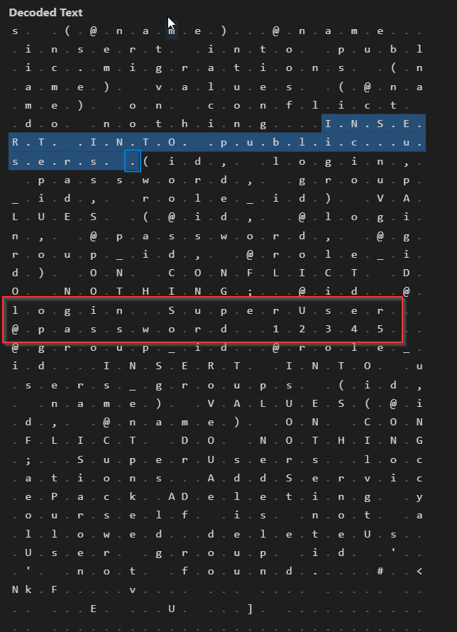

## Использование защитых учетных записей

Анализируемый проект - `inone-ng-users-api`  
Анализируемый файл - `SuperUserDM.cs`
### Проблемный код:  
```
var addSuperUserSql = "INSERT INTO public.users (id, login, password, group_id, role_id)" +
                                  " VALUES (@id, @login, @password, @group_id, @role_id) " +
                                  "ON CONFLICT DO NOTHING;";

using (var cmd = new NpgsqlCommand(addSuperUserSql, connection))
{
    cmd.Parameters.AddWithValue("@id", NpgsqlDbType.Uuid, Guid.NewGuid());
    cmd.Parameters.AddWithValue("@login", NpgsqlDbType.Text, "SuperUser");
    cmd.Parameters.AddWithValue("@password", NpgsqlDbType.Text, PasswordUtils
        .GenerateHash("12345", mainConfiguration.InOneConfig.Security.Rfc2898IterationCount));
    cmd.Parameters.AddWithValue("@group_id", NpgsqlDbType.Uuid, InOneConstants.InOneSuperUserGroup);
    cmd.Parameters.AddWithValue("@role_id", NpgsqlDbType.Uuid, Guid.Empty);


    await cmd.ExecuteNonQueryAsync();
}
```  

### Описание проблемы:  
В коде программы используются защитые логин и пароль для УЗ `суперпользователя`.  
УЗ этого пользователя обладает всеми привилегиями в системе.  
Так же при первом входе в систему нет механизма обязательной смены пароля `суперпользователя`.  

### Демонстрация использования уязвимости:  
В ходе сборки программы на компиллируемом языке все строковые данные сохраняются в выходной сборке в секции `.text`
Для удобства можно выгрузить эти секцию в отдельный файл:  
`objcopy -O binary --only-section=.text inone-ng-users-api.dll inone-ng-users-api.dll.text`  


### Используемое ПО
- Visual Studio Code
- Linux utils (objdump, objcopy)